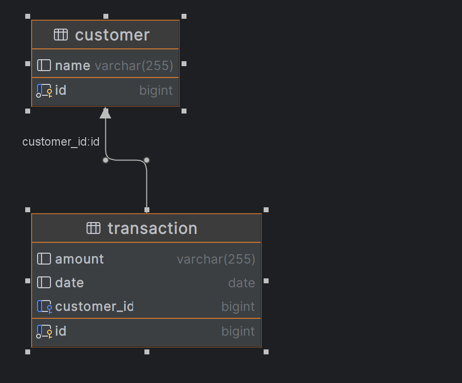

## Reward System

### DB



### How to run the code
1. Clone the repository
2. Run the following command in the terminal
```bash
mvn spring-boot:run
```
NOTE: default port is changed to 8090 in the application.properties file
3. Open the browser and go to the following URL
```bash
http://localhost:8090
```

### Endpoints


### API Endpoints

```http
POST   /api/v1/customer
    # Create a new customer (returns HTTP 201)

POST   /api/v1/transaction
    # Create a new transaction (returns HTTP 201)

GET    /api/v1/transactions/{customerId}
    # Get all transactions for a customer (sorted by date desc)

GET    /api/v1/calculateRewards/{customerId}
    # Get total and per-month rewards for a customer

GET    /api/v1/calculateRewardsByRange/{customerId}?startDate=YYYY-MM-DD&endDate=YYYY-MM-DD
    # Get rewards for a customer in a custom date range

GET    /api/v1/calculateRewardsByMonths/{customerId}?months=N
    # Get rewards for a customer for the last N months (months >= 1)
```


### Sample Requests and Responses

To create a new customer record

```bash
curl -X POST --location "http://localhost:8090/api/v1/customer" \
    -H "Content-Type: application/json" \
    -d '{
        "name": "user13"
    }'
```

Response:
```json
{
  "id": 1,
  "name": "user13"
}
```

To create a new transaction record by customer id

```bash
curl -X POST --location "http://localhost:8090/api/v1/transaction" \
    -H "Content-Type: application/json" \
    -d '{
  "amount": 201.0,
  "date": "2022-05-21",
  "customerId": 19
}'
```

Request DTO:
```json
{
  "amount": 201.0,
  "date": "2022-05-21",
  "customerId": 19
}
```
Response:
```json
{
  "id": 1,
  "amount": 201.0,
  "date": "2022-05-21"
}
```

To get trasaction records by customer id, here 12 is the customer id
```bash
curl -X GET --location "http://localhost:8090/api/v1/transactions/12"
```

### response
NOTE: sorted by date in descending order

we will get the response in the following format

```json
[
  {
    "id": 184,
    "amount": 892.0,
    "date": "2023-12-15"
  },
  {
    "id": 207,
    "amount": 186.0,
    "date": "2023-11-08"
  },
  {
    "id": 49,
    "amount": 536.0,
    "date": "2023-08-22"
  }
]
```

### Reward Calculation


```bash
curl -X GET --location "http://localhost:8090/api/v1/calculateRewards/12"
```

Response:
```json
{
  "customerId": 12,
  "customerName": "user13",
  "transactions": [
    {
      "id": 184,
      "amount": 892.0,
      "date": "2023-12-15"
    }
  ],
  "totalPoints": 12070,
  "pointsPerMonth": {
    "2023-8": 2416,
    "2023-11": 222
  }
}
```

#### Calculate Rewards By Date Range

```bash
curl -X GET --location "http://localhost:8090/api/v1/calculateRewardsByRange/12?startDate=2023-01-01&endDate=2023-12-31"
```

Response:
```json
{
  "customerId": 12,
  "customerName": "user13",
  "transactions": [
    {
      "id": 184,
      "amount": 892.0,
      "date": "2023-12-15"
    }
  ],
  "totalPoints": 12070,
  "pointsPerMonth": {
    "2023-8": 2416,
    "2023-11": 222
  }
}
```

#### Calculate Rewards By Months

```bash
curl -X GET --location "http://localhost:8090/api/v1/calculateRewardsByMonths/12?months=3"

---
#### Notes on Code & Configuration

- All endpoints now use `/api/v1` as the base path.
- Resource creation endpoints return HTTP 201 (Created).
- All monetary values are handled with high precision (`BigDecimal`).
- DTOs are immutable for safety and clarity.
- Input validation is enforced (e.g., `months` must be ≥ 1).
- Database credentials are now set via environment variables in `application.properties`.
- `spring.jpa.hibernate.ddl-auto=update` is commented out for production safety.
```

Response:
```json
{
  "customerId": 12,
  "customerName": "user13",
  "totalPointsInPeriod": 1200,
  "pointsPerMonth": {
    "2023-8": 416,
    "2023-7": 784
  },
  "monthsConsidered": 3
}
```
